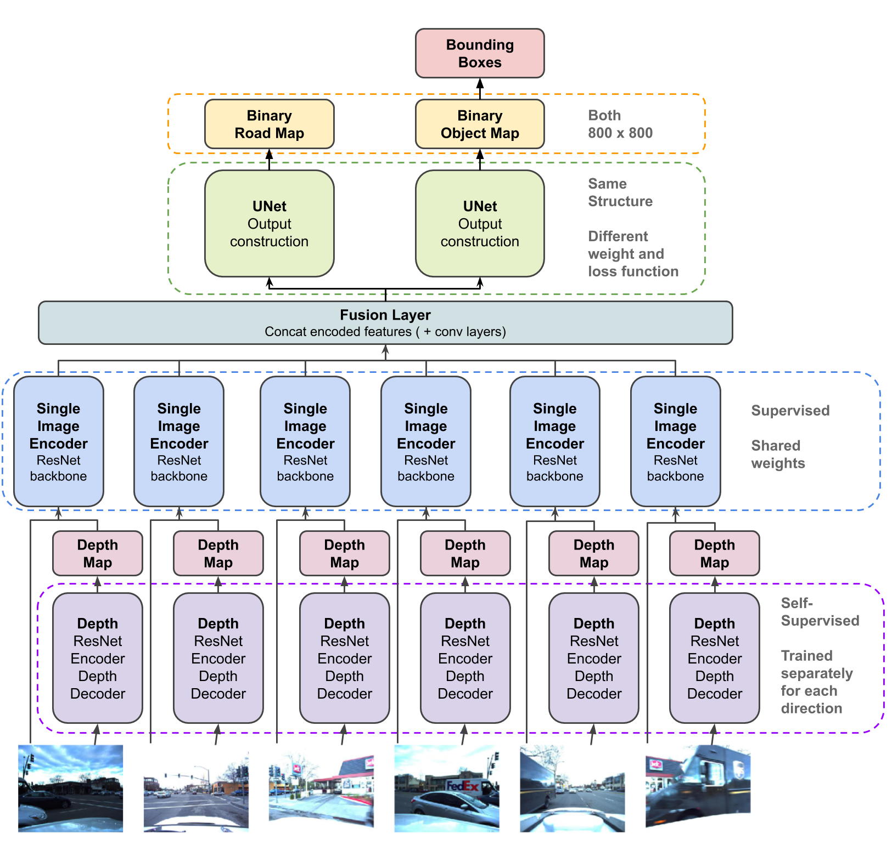

# HexaLayout: From images to roadmap and object detection on BEV
authors: Ying Jin, Xiao Li, Shiqing Li

working repository for dl final project

### Abstract 

### Model architecture

### Usage 
Our implementation does not rely on any pre-trained networks, rather it is all built from scratch. To fully utilize our model, please download dataset from [here](https://drive.google.com/drive/folders/1wXQmPyoEGkHB8Jq2uZ2uSZa7TgLhw3Mb).

**Train HexaLayout**  
run `python train_unet.py --folder_dir ./DLSP20Dataset/`

**Train HexaLayout with Discriminator**  
run `python train_unet_discri.py --folder_dir ./DLSP20Dataset/`
